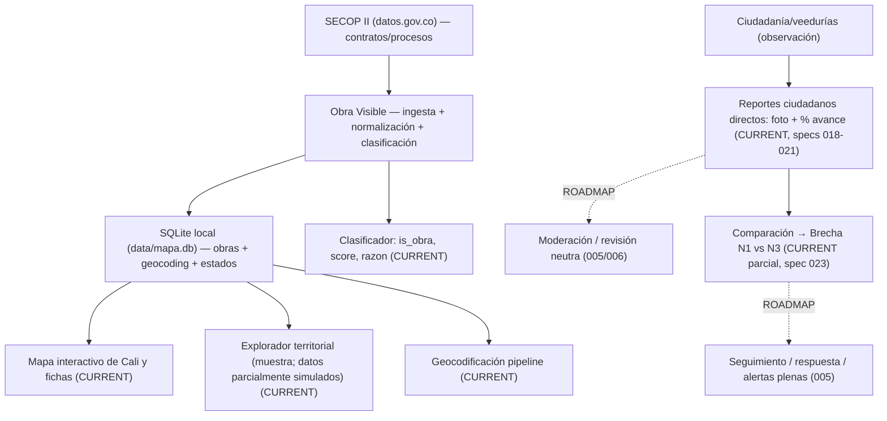

# Obra Visible — Master Context

> **Qué es este documento**: síntesis estructurada y trazable del conocimiento del proyecto, derivada de la Knowledge Base (`docs/knowledge/`). **No es la fuente primaria de verdad**: cuando exista discrepancia, mandan las fuentes primarias (código, datos) y los documentos de la KB que las reflejan. Ver `docs/knowledge/README.md`.

> **Convención de estados en todo el documento**: `CURRENT` (existe hoy) · `DESIGNED` (diseñado) · `ROADMAP` (planeado) · `HYPOTHESIS` (no validado) · `HISTORICAL` (anterior) · `DEPRECATED` (no vigente).

---

## 1. Identidad del proyecto

- **Nombre**: Obra Visible. En la UI aparece como **"Obras a la Vista"**; metadata de la app: "Obras de Cali a la vista"; nombre legacy del paquete: `impacto-territorial-landing`. (`01-product-identity.md`)
- **Definición corta**: plataforma web (MVP prototipo) de **consulta ciudadana de obra pública en Cali**, que presenta en un mapa interactivo contratos de obra públicos (SECOP II) con su ubicación aproximada y su ficha.
- **Propósito**: hacer accesible la información de obra pública de Cali que hoy vive en SECOP II (oficial pero difícil de consultar), con un aviso claro de prototipo. (`01`)
- **Categorías**: CivicTech / producto de datos públicos (CURRENT); aspira a GovTech + B2B2C + ESGTech (visión). Ver §18.
- **Frase conceptual** (visión documentada, no implementada): "plataforma de inteligencia territorial que transforma datos de contratación pública y reportes corporativos en evidencias geolocalizadas, verificadas y comparables". (`docs/02-estrategia-arquitectura.md`, `02-vision-y-producto.md`)
- **Problema central** (interpretación del proyecto, HYPOTHESIS): desconexión entre el dato oficial y la realidad física del territorio; poca visibilidad y baja verificabilidad. (§4)
- **Solución central**: datos oficiales georreferenciados + observación/evidencia ciudadana contrastada → seguimiento.

**En una sola explicación**: Obra Visible es un mapa-ciudadano de la obra pública de Cali construido sobre los datos abiertos de SECOP II, que nació con la visión —aún no implementada— de cerrar la brecha entre lo que dicen los contratos y lo que pasa en el territorio, con evidencia verificada y un modelo sostenible.

---

## 2. Resumen ejecutivo

Obra Visible parte de un problema documentado pero no validado con datos propios: en Colombia la contratación pública e inversión social es cuantiosa, pero la información está fragmentada, vive en silos (Excel, PDFs) o en plataformas oficiales difíciles de consultar, y no se conecta con el estado físico real de las obras en el territorio. La propuesta del proyecto es una plataforma que cruce los datos oficiales (SECOP II) con observación territorial para generar evidencia, seguimiento y confianza.

Hoy el producto es un **MVP prototipo** con tres caras públicas: una **landing** ("Obras a la Vista"), un **explorador territorial** de proyectos (pequeña muestra, parcialmente simulada) y un **mapa de obras de Cali** que sí consume datos reales guardados en una base local (SQLite) sincronizada desde SECOP II. Toda la app muestra un aviso de prototipo ("datos no fiables").

Los **usuarios actuales** son ciudadanos que consultan obras (mapa real). Los **clientes son conceptuales/objetivo**: empresas con licencia social para operar, fondos ESG y aseguradoras (documentados en docs, sin evidencia de clientes reales). El **modelo de negocio** (gratis para ciudadanía + SaaS por tiers + fee por proyecto + informes) es una propuesta, no está implementado ni validado.

El **estado real** es un producto funcional de consulta con participación ciudadana básica (reportes persistentes) y un motor de brechas inicial (spec 023); la visión B2B/ESG, la captura de campo PWA, la moderación plena y los perfiles de empresa permanecen como specs planificadas (ROADMAP). Ver §12 y §14.

---

## 3. Propósito y visión

### Propósito actual (CURRENT)

- Permitir que cualquier persona consulte la obra pública de Cali en un mapa con filtros (estado, entidad, valor, año), vea ubicación aproximada, y acceda a la ficha y al enlace oficial SECOP.
- Corregir expectativas con un **aviso de prototipo** global (datos no fiables / en construcción).

### Visión futura (DESIGNED/ROADMAP/HYPOTHESIS)

- **Visibilidad**: conectar el registro contractual con el lugar físico y el avance real.
- **Verificación**: que ciudadanos/veedurías aporten evidencia (fotos con GPS/fecha) por la plataforma.
- **Largo plazo**: plataforma multiactor de inteligencia territorial y "infraestructura de confianza" (§30), con perfil por empresa y reportes ESG.

**Regla**: la visión NO es el estado actual. Nada del roadmap debe presentarse como existente (encargo, reglas 5 y 43).

---

## 4. Problema

Cadena causal (interpretación del proyecto; etiquetar como HYPOTHESIS/histórico, no como dato empírico verificable):

```text
información pública (contractual) generada y fragmentada
        ↓
dificultad de acceso / consulta (SECOP II, PDFs, silos)
        ↓
poca visibilidad del estado territorial real
        ↓
dificultad para contrastar (oficial vs. físico)
        ↓
señales tardías de atraso / paralización / conflicto
        ↓
menor capacidad de reacción de comunidades, entidades y empresas
```

Fuentes de la interpretación: `docs/02-estrategia-arquitectura.md` (4 fallas estructurales), `docs/archive/sustento.md`, `02-vision-y-producto.md`. No hay estudio propio que demuestre la cadena como hecho empírico.

---

## 5. Actores y usuarios

| Actor                                    | Rol                           | Qué puede hacer HOY (CURRENT)      | Qué se le diseñó/proyecta                            |
| ---------------------------------------- | ----------------------------- | ----------------------------------- | ------------------------------------------------------- |
| **Ciudadanía**                    | Usuario principal             | Consultar mapa, ver ficha, filtrar  | (ROADMAP) reportar, seguir obras, ver brechas           |
| **Veedurías / comunidades / JAC** | Usuario validador             | Consultar mapa                      | (ROADMAP 004/006) subir evidencia foto+GPS, reportes    |
| **Entidades públicas**            | Stakeholder / fuente          | — (son fuente en SECOP)            | Transparencia, visibilidad, posible respuesta           |
| **Empresas / contratistas**        | Cliente objetivo (HYPOTHESIS) | Aparecen como contratista en fichas | (ROADMAP 008) perfil público por NIT, responder, sello |
| **Interventorías**                | Actor de control              | —                                  | (ROADMAP 005/006) descargos con actas en disputas       |
| **Banca / fondos / aseguradoras**  | Cliente objetivo (HYPOTHESIS) | —                                  | (ROADMAP/hist.) informes de riesgo/ejecución           |

**Distinción**: usuarios = ciudadanía/veedurías; clientes = empresa/B2B (conceptual); stakeholder/beneficiario = comunidad y entidades. No confundir (`docs 02`, `10-b2b-y-leads.md`).

---

## 6. Propuesta de valor

### Beneficio esperado (diseño/hipótesis — NO validado)

- **Ciudadanía**: transparencia, acceso, seguimiento, participación y verificación.
- **Organizaciones**: gestión, monitoreo, reputación (sello), información territorial, trazabilidad de contratistas, respuesta a reportes.
- **Actores financieros**: información de ejecución y riesgo (informes).

### Beneficio validado (CURRENT)

- Solo **técnico**: consultar obras reales de Cali georreferenciadas (1434 obras en DB local, 146 con ubicación resuelta al 2026-09-20). No hay validación de mercado, adopción ni impacto.

Distingue SIEMPRE "esperado" de "validado" (`12-hipotesis-y-validacion.md`).

---

## 7. Cómo funciona Obra Visible



Puntos clave: ingesta real de SECOP II (paginada, con app-token opcional); normalización de campos; clasificación heurística de "obra" (score); geocodificación multinivel (Nominatim → Overpass intersección → Photon → texto → barrio). Ver `05-datos-secop.md`, `07-geocodificacion.md`.

---

## 8. Fuentes de datos

### Oficiales (CURRENT)

- **SECOP II** — contratos de Cali (dataset contratos jbjy-vk9h vía `secopFetcher.ts`; filtro ciudad=CALI + tipo Obra/Concesión/APP). Sincronización hacia SQLite.
- **SECOP II — procesos** (vía `secop.ts`) para el explorador, mezclado con datos simulados. ⚠ **No confundir** con la DB real.
- Configuración: `SOCRATA_APP_TOKEN` opcional (env), rate-limiting tolerante a 429.

### Derivadas por la plataforma (CURRENT)

- `is_obra`, `obra_score`, `obra_razon` (clasificador); `estado_ubicacion` (pendiente/resuelta/no_determinada), `geo_confianza` (alta/media/baja), fuente de geocoding, hash de integridad.

### De usuario (CURRENT parcial)

- **Reportes ciudadanos** (specs `018`-`021`, implementadas 2026-09-23): persisten en `reportes_ciudadanos` con estado `pendiente_moderacion`; anti-spam funcional (10/h por contacto, 40/h por IP); CRUD en modo demo (editar/eliminar con foto); GET nunca expone `contacto`. **Moderación/revisión neutra**: ROADMAP (nada aprueba/filtra todavía).
- Captura foto+GPS de campo con EXIF/PWA (spec 004): solo diseño, sin persistencia de evidencias.

### Otras (ROADMAP/HYPOTHESIS)

- VITAL/ANLA (009), BPIN/SIIPO/ART (mencionadas en `docs/02` para el caso OxI Guamal), datos privados N2 (empresarial). **No integradas**.

Regla: una fuente solo aporta lo que realmente ofrece. SECOP da datos contractuales; no da % de avance físico verificado (eso sería N3, inexistente). `05`, `08`, `99-source-registry.md`.

### Cumplimiento legal/TOS

- Cada fuente tiene condiciones de uso (atribución SECOP CC BY-SA, límites Nominatim/Overpass/Photon, ánimo del Portal datos.gov.co, privacidad Ley 1581/2012). **Antes de producción real hay que ajustar**: atribución visible, self-host de geocodificación y revisión legal. Detalle y matriz en `15-cumplimiento-legal-tos.md`.

## 9. Verificación ciudadana

- **Estado actual (CURRENT)**: los reportes ciudadanos **persisten** en SQLite (`reportes_ciudadanos`, estado `pendiente_moderacion`) con foto y % de avance; existe CRUD demo (specs `018`-`021`) y anti-spam. **NO** hay moderación, revisión neutra ni protocolo de disputa (ROADMAP 005/006). El enmascaramiento de contacto ante empresas es nativo (GET nunca devuelve `contacto`). El **motor de brechas inicial** (spec `023`) cruza N1 (financiero SECOP) con N3 (reportes) en API y UI; hoy N1 es `null` en toda la DB (espejo truncado, ver `05`).
- **Diseñado (SPEC 004/006, ROADMAP)**: captura de foto con EXIF (GPS+fecha saneados), offline-first (PWA + IndexedDB), cola de sincronización, deduplicación, validación del id_contrato, moderación, confirmación en la plataforma (sesión/correo). [Decisión 2026-09-20: se retira WhatsApp del producto; el reporte se sube directo a la plataforma.]
- **Cómo se registra/georreferencia/fecha** (diseñado): formulario web / PWA (reporte directo en la plataforma); EXIF/GPS extraídos en cliente; timestamp del reporte.
- **Interpretación**: un reporte ciudadano es una **observación/evidencia aportada por un usuario; NO implica automáticamente irregularidad, fraude o incumplimiento**. Requiere moderación y protocolo de disputa.

Fuentes: `10-b2b-y-leads.md`, `specs/004-captura-evidencia-campo`, `specs/006-canal-comunitario-moderacion`, `specs/018-021`, `specs/023-motor-brechas-avance-secop-campo`.

---

## 10. Concepto de brecha

- **Definición (parcialmente implementada — CURRENT/ROADMAP)**: Índice de Brecha = |% Ejecución SECOP II (N1) − % Avance Evidencia Campo (N3)|. Existe además un N2 (avance reportado por la empresa). Si gap > 15%, se activa Alerta de Riesgo Territorial (umbral = hipótesis inicial, debe parametrizarse). Fuente: `docs/02-estrategia-arquitectura.md` §6.3, `specs/005-gap-analysis-engine`, `specs/023`.
- **Cómo se genera**: N3 = evidencia de campo (reportes ciudadanos); promedio ponderado dando más peso a evidencias recientes/geolocalizadas.
- **Interpretación responsable**: una brecha puede tener **explicación legítima** (desfase temporal, error de reporte oficial, medición distinta). **No es por sí sola evidencia de corrupción o incumplimiento**; requiere revisión neutra.
- **Limitaciones**: depende de calidad de datos oficiales y de evidencia; umbral 15% es hipótesis; requiere protocolo de disputas (spec 006) y descargos (actas de interventoría).
- **Estado hoy**: motor **implementado** (spec `023`, 2026-09-24): `src/lib/mapa/brechas.ts` calcula N1 (financiero SECOP) y N3 (promedio de avance en reportes), expone `avanceSecop/avanceCampo/brecha/estadoBrecha` en `/mapa/obras` y bloque **"Análisis de avance"** en mapa y explorador (barras + alerta >15 pts + guía de lectura). ⚠ El espejo `jbjy-vk9h` está truncado a 1000 filas (2026-09-23, ver `05`): nuestros contratos no están en la fuente → **N1 es `null`** en toda la DB → estado honesto `sin_datos` (sin falsas alertas) hasta que el dataset vuelva a contenerlos.

---

## 11. Confianza y gobernanza

Mecanismos para la credibilidad (marcando qué existe y qué está diseñado):

| Mecanismo                                                 | Estado                    | Fuente                      |
| --------------------------------------------------------- | ------------------------- | --------------------------- |
| Trazabilidad de fuentes (url_secop en ficha)              | CURRENT                   | `08-mapa-y-explorador.md` |
| Aviso de prototipo (datos no fiables)                     | CURRENT (PrototypeNotice) | `specs/010`, `03`       |
| Sanajeo de EXIF (solo GPS+fecha, sin EXIF crudo)          | ROADMAP (spec 004)        | spec 004                    |
| Enmascaramiento del contacto ciudadano                    | ROADMAP (spec 006)        | spec 006                    |
| Protocolo de revisión neutra / disputas                  | ROADMAP (specs 005/006)   | spec 005,`docs/02`        |
| Evidencia cruzada (≥3 reportes <500m o 5 días hábiles) | ROADMAP (spec 006)        | spec 006,`docs/02`        |
| Auditoría de transiciones de estado                      | ROADMAP (spec 005)        | spec 005                    |
| Anti-spam (5 reportes/hora)                               | ROADMAP (spec 006)        | spec 006                    |

Diferenciar SIEMPRE: **información oficial ≠ observación ciudadana ≠ interpretación del sistema ≠ conclusión validada** (regla especial 38).

La confianza es clave para ciudadanía (credibilidad), empresas/reputación (sello bajo 15% de brecha), instituciones (dato oficial contrastable) y modelo de negocio (la ciudadanía gratis genera la credibilidad que se vende). `docs/02`.

---

## 12. Estado actual del producto

| Funcionalidad / componente                                  | Estado              | Evidencia                                 | Observaciones                                                                                            |
| ----------------------------------------------------------- | ------------------- | ----------------------------------------- | -------------------------------------------------------------------------------------------------------- |
| Landing pública "Obras a la Vista"                         | CURRENT             | `src/app/page.tsx`, `README`          | Hero, preview de mapa, secciones, aviso                                                                  |
| Explorador territorial (/explorador)                        | CURRENT             | `SecopExplorer.tsx`                     | Datos**parcialmente simulados** (no es la DB real)                                                 |
| Mapa de obras de Cali (/mapa)                               | CURRENT             | `src/app/mapa/*`, `MapaCali*`         | Datos reales desde SQLite; filtros; panel detalle                                                        |
| Ingesta SECOP II (contratos Cali)                           | CURRENT             | `secopFetcher.ts`, `syncService.ts`   | Paginada, tolerante a 429, normaliza + clasifica                                                         |
| Base SQLite local (`data/mapa.db`, git-ignored)           | CURRENT             | `db.ts`, query en vivo                  | 1434 obras; 364`resuelta`, 1070 `pendiente` (2026-09-23); geocodificación priorizada (activas primero, `geo_intentos` al fallar)                                    |
| Clasificador de obra (score)                                | CURRENT             | `clasificador.ts`                       | Heurístico por tipo/UNSPSC/keywords                                                                     |
| Geocodificación (pipeline multi-fuente)                    | CURRENT             | `geocodeService.ts`, `direccionCO.ts` | Nominatim → Overpass → Photon → texto → barrio;`enCali` gate; migración v2 (`geo_migracion_v2`) |
| APIs públicas (mapa/obras, mapa/actualizar, secop, lead-*) | CURRENT             | `src/app/api/**`                        | `/mapa/*` reales; `lead-*` solo log                                                                  |
| Aviso de prototipo global                                   | CURRENT             | `PrototypeNotice.tsx`, `layout.tsx`   | spec 010 implementada                                                                                    |
| Analítica (Meta Pixel/GA4 por env)                         | CURRENT             | `layout.tsx`                            | Solo si hay env vars                                                                                     |
| Perfil público por empresa (008)                           | ROADMAP             | spec 008                                  | No existe código                                                                                        |
| Motor de brechas / alertas (005)                            | CURRENT (parcial)       | spec 023, `brechas.ts`     | Bloque "Análisis de avance" (N1 vs N3) en mapa/explorador + API; N1 `null` mientras el espejo esté truncado (ver `05`) |
| Captura de evidencia campo / PWA (004)                      | ROADMAP             | spec 004                                  | No existe código                                                                                        |
| Canal comunitario y moderación (006)              | CURRENT (parcial)             | spec 018-021, `reportes_ciudadanos` | Reportes persisten (`pendiente_moderacion`) + CRUD demo + anti-spam; falta panel de moderación, evidencia cruzada y disputas |
| Reportes ESG / ART (007)                                    | ROADMAP             | spec 007                                  | No existe código                                                                                        |
| Ingesta VITAL/ANLA (009)                                    | ROADMAP             | spec 009                                  | No existe código                                                                                        |
| Cruce PDET/ZOMAC (003)                                      | ROADMAP             | spec 003                                  | No existe código                                                                                        |
| Leads B2B/ciudadano                                         | CURRENT (parcial)   | `B2bLeadMagnet`, rutas lead-*           | Solo validación + log, no persiste                                                                      |
| Verificación ciudadana                                     | DESIGNED (simulado) | `CitizenVerificationModal`              | Simulación de cliente; sin persistencia                                                                 |

⚠ Los números de la DB son del 2026-09-20; pueden cambiar tras cada sync (`06-base-de-datos-sqlite.md`, `99-source-registry.md`).

## 13. Funcionalidades actuales (solo lo disponible)

1. **Landing pública** informativa con aviso de prototipo.
2. **Explorador territorial** de proyectos (todas las obras reales de Cali; filtros unificados con el mapa).
3. **Mapa interactivo de obras de Cali**: marcadores agrupados (Leaflet + markercluster), filtros (estado contrato, entidad, valor, años inicio/fin), panel de detalle por obra (contratista, entidad, fechas, valor, enlace SECOP), totales y última sync.
4. **Sync de datos** SECOP → SQLite (manual vía `/api/mapa/actualizar` el dispara; con lock de concurrencia). Aviso si el dataset viene truncado (sin borrar nada).
5. **Clasificación** automática contrato→"obra" (con score y razón).
6. **Geocodificación** de direcciones en Cali con estados y confianza.
7. **Reportes ciudadanos** (persistentes en SQLite, estado `pendiente_moderacion`): ver/crear/editar/eliminar (demo) con foto y % avance; anti-spam; GET sin contacto.
8. **Análisis de avance (motor de brechas, spec 023)**: N1 (SECOP financiero) vs N3 (campo) con umbral 15, guía de lectura en mapa y explorador. N1 hoy `null` (espejo truncado).
9. **Formularios/leads** B2B y ciudadano (validación + log; sin almacenamiento).
10. **Aviso de prototipo** global.
11. **Analítica** condicionada a variables de entorno (Meta Pixel/GA4 configurable).

Nada más (no hay moderación, revisión neutra, PWA de campo, perfiles de empresa, ESG, VITAL, PDET).

---

## 14. Roadmap

Especificaciones LeanSpec planificadas (estado frontmatter: `planned`). Contenido tomado de los README de specs (no inferido). Todas dependen de la ingesta SECOP (001, ya complete).

| Spec / funcionalidad                           | Propósito                                                                                                                                  | Estado  | Dependencias  | Comentarios                                                                    |
| ---------------------------------------------- | ------------------------------------------------------------------------------------------------------------------------------------------- | ------- | ------------- | ------------------------------------------------------------------------------ |
| **003** PDET/ZOMAC                       | Etiquetar contratos con municipio/DIVIPOLA y zonas PDET/ZOMAC; filtro y badges; cruce con brechas                                           | planned | 001, 002      | Diccionario divipola; geo_status=unresolved para no asignables                 |
| **004** Captura de evidencia campo (PWA) | Fotos con EXIF (GPS+fecha), offline-first, sincronización, deduplicación; alimenta N3                                                     | planned | 001           | exifr en cliente; bucket de objetos; estados pending/synced/invalid/duplicated |
| **005** Motor de brechas                 | gap =\|N1−N3\|; alertas si >15%; estados de gobernanza (bajo_revision_neutra)                                                              | planned | 001, 002, 004 | Umbral 15% es hipótesis; recálculo ≤2s; audit log                           |
| **006** Canal comunitario y moderación  | Reportes (texto/foto/GPS) subidos directo en la plataforma; cola de moderación; evidencia cruzada (≥3 <500m / 5 días hábiles); anti-spam; enmascaramiento | planned | 005           | Reporte directo (formulario web/PWA); no exponer contacto a empresas            |
| **007** Reportes ESG y ART               | Generador de informes GRI/ISSB/ODS y de avance OpI (ART/DIAN) con datos N1/N2/N3 verificados; PDF/XLSX                                      | planned | 001, 005      | Para OpI requiere BPIN, entidad, contratista, presupuesto, %avance             |
| **008** Perfil público por empresa      | Vitrina por NIT: mapa, brechas, badges, reportes, benchmark anónimo; CTA "Reclama tu perfil"→lead                                         | planned | 002, 005, 007 | ISR revalidate 600s; control de visibilidad por plan                           |
| **009** Ingesta VITAL (ANLA)             | Extraer resoluciones/licencias ambientales; OCR en PDFs; trazabilidad ambiental en fichas                                                   | planned | 001           | Backoff/cortesía frente a 429/503; no abusar del origen                       |

El roadmap no incluye fechas ni SLAs. Fuentes: `specs/003-009/README.md`, `11-roadmap-y-specs.md`.

---

## 15. Arquitectura conceptual y técnica

- **Frontend/UI**: Next.js App Router + React + Tailwind. Páginas `/` (landing), `/explorador`, `/mapa`. Leaflet + react-leaflet + markercluster (mapa); wrappers SSR-safe (`MapaCaliDynamic`) porque Leaflet no corre en server. Componentes agrupados en `src/components/**`.
- **Backend**: route handlers en `src/app/api/**` (`/mapa/obras`, `/mapa/actualizar`, `/secop`, `/lead-b2b`, `/lead-citizen`). Sin auth (prototipo).
- **Base de datos**: SQLite local `data/mapa.db` (better-sqlite3), git-ignored, con tablas `obras`, `ubicaciones`, `sync_runs`, `meta`. Sin almacenamiento externo en la nube.
- **Integraciones**: SECOP II vía SODA API (fetch HTTP paginado, app-token opcional); geocodificación con Nominatim, Overpass y Photon (código). [Decisión 2026-09-20: se elimina WhatsApp del producto.]
- **Procesamiento**: `syncService.ts` (sync incremental + hash), `clasificador.ts`, `geocodeService.ts`, normalización en `secopFetcher.ts`.
- **Infraestructura**: la del deploy no está documentada en el repo (sin Docker/k8s/vercel.com visible); asumir deploys estándar Next.js. `No confirmado`.
- **Autenticación**: ninguna implementada (visión: roles por plan en 008, ROADMAP).
- **Almacenamiento de evidencias**: ROADMAP (bucket de objetos, spec 004).

Fuentes: `04-stack-tecnico.md`, `03-implementacion-actual.md`, `09-apis-y-rutas.md`.

## 16. Modelo de negocio

Modelo **documentado** (HYPOTHESIS; sin implementación ni clientes reales). Fuentes: `docs/archive/modelos_monetizado.md`, `docs/02-estrategia-arquitectura.md` §5, `10-b2b-y-leads.md`, `specs` afectadas.

### Gratis para ciudadanía (SEMPRE; da credibilidad)

- Mapa/explorador de contratos SECOP, fichas de obra.
- Reporte ciudadano con foto/GPS subido directo en la plataforma (sin cuenta) — ROADMAP.
- Alertas básicas: seguir hasta 3 obras y recibir cambios de estado — ROADMAP.
- Ficha pública básica de la entidad (vitrina). El "sello como dato visible" gratis.

### Base — ESG Analytics (B2B, concepto)

- Conector SECOP II + tableros internos; generador de reportes GRI/ISSB S1/S2 con cifras y fuentes citadas. Sin mapa público propio, sin sello, sin captura ciudadana.

### Pro — Licencia Social y Territorio (B2B, concepto)

- Todo Base + ficha pública gestionada (hitos, fotos oficiales, actas, BPIN), sello visible mientras brecha ≤15%, canal comunitario moderado (spec 006), alertas tempranas.

### Enterprise — Trazabilidad de contratistas (B2B, concepto)

- Todo Pro + perfil por contratista (historial/brechas/reportes), motor de brechas agregado (005), reportes ART/OxI (007), roles y permisos.

### Fee por proyecto OxI (pago por uso, concepto)

- Monitoreo dedicado de un proyecto de Obras por Impuestos; expediente listo para DIAN/ART; se cobra por proyecto con inicio y fin.

### Informes de riesgo (compra puntual, concepto)

- Informes para aseguradoras/fondos ESG (ejecución, retraso, brecha histórica, reportes ciudadanos). No acceden a la plataforma; compran el documento.

**Clientes mencionados (Celsia, Ecopetrol, Cerrejón, Odinsa, Promigas, etc.) son EJEMPLOS CONCEPTUALES en los docs.** No hay evidencia de que sean clientes reales. No presentarlos como clientes (regla especial 39).

---

## 17. Regla de monetización

> La ciudadanía conserva acceso al nivel fundamental de transparencia y participación; el pago se concentra en capacidades de gestión, analítica, respuesta, trazabilidad y herramientas empresariales.

| Ciudadanía (gratis)                    | Organizaciones (pago)                    |
| --------------------------------------- | ---------------------------------------- |
| Ver información pública (mapa/fichas) | Gestionar la ficha y responder reportes  |
| Ver brechas y estado                    | Analizar brechas (motor/alertas)         |
| Reportar (foto/GPS directo en la plataforma)        | Alertas tempranas + motor de brechas     |
| Seguir obras (alertas básicas)         | Gestionar proyectos/varios contratistas  |
| Ver estado / sello como dato            | Sello gestionado + reportes GRI/ISSB/ART |

Desglose de `modelos_monetizado.md`: "Nunca detrás de pago" vs "Siempre detrás de pago". Aplica coherentemente en valor, negocio, producto, pitch y visión.

---

## 18. Modelo de plataforma

- **CivicTech/GovTech**: comparte características (datos públicos, participación, gobierno) — parcialmente (CURRENT la consulta; participación ROADMAP).
- **SaaS**: el modelo de ingresos propuesto es SaaS/tiers B2B (concepto, no vigente).
- **B2B2C**: la estructura actores (C2B/B2B) coincide con la visión (empresas pagan, ciudadanía consume).
- **ESGTech**: solo en roadmap (007/008) e hipótesis (docs/archive).
- **Plataforma multiactor / infraestructura de información**: visión de largo plazo (§30), no demostrable hoy.

**Declaración**: hoy es principalmente un **producto de datos públicos (consulta)**, con características incipientes de **CivicTech**; el resto son **comparte rasgos / hipótesis / visión**, no categorías confirmadas (`00-index.md` contradicciones, `02`).

---

## 19. Deseabilidad

### Hipótesis de deseabilidad (documentadas, sin evidencia propia)

- Los ciudadanos quieren ver en qué se gasta la obra pública de su barrio/municipio.
- Las veedurías quieren validar estado físico (evidencia) con herramientas simples.
- Las empresas precisan demostrar avance ante comunidad/ART/DIAN y comprar gestión/reputación.

### Evidencia de deseabilidad

- **No existe** en el repositorio: sin encuestas publicadas, sin analítica de uso, sin registros reales. El doc `04-hipotesis-validacion.md` propondía experimentos (Meta Ads, CTR >2.5%, conversión >10%, +500 clics/+50 registros, CPL B2B, venta en frío de MVP espejo) — **como diseño**, no como resultado.

Fuente: `12-hipotesis-y-validacion.md`, `docs/04-hipotesis-validacion.md`.

---

## 20. Factibilidad

| Punto                                   | Clasificación                                     | Detalle                                                                                |
| --------------------------------------- | -------------------------------------------------- | -------------------------------------------------------------------------------------- |
| Datos SECOP II                          | **Resuelto**                                 | Ingesta funcional (pagínada, tolerante a 429)                                         |
| Geocodificación Cali                   | **Resuelto** (parcial)                       | Pipeline multi-fuente; 364 de 1434 resueltas (incluye obras activas 2024-2026); migración v2 aplicada                   |
| Clasificación de obra                  | **Resuelto**                                 | Heurística funcional                                                                  |
| Almacenamiento                          | **Resuelto** local; ROADMAP en nube (bucket) | SQLite local git-ignored; evidencias en bucket = spec 004                              |
| Verificación/evidencia (EXIF/GPS, PWA) | **Implementable**                            | Spec 004 detallada; requiere PWA + API multipart + bucket                              |
| Captura de evidencia de campo (reporte directo) | **Implementable**                            | Formulario web/PWA + persistencia (specs 004/006)                                             |
| Moderación                             | **Implementable**                            | Spec 006; cola + panel + anti-spam                                                     |
| Motor de brechas                        | **Implementado** (parcial)                            | `brechas.ts` (N1 vs N3, umbral 15, API + UI); N2 queda ROADMAP (008); N1 vivo cuando el espejo SECOP vuelva a completo |
| Reportes ESG/PDF                        | **Implementable**                            | Spec 007; plantillas + cola de trabajos                                                |
| Escalabilidad                           | **Riesgo / requiere diseño**                | SQLite local no escala a multi-usuario/escritura concurrente; ausencia de auth         |
| Seguridad                               | **Riesgo**                                   | Sin auth; webhooks no firmados (spec 006 plantea firmas); privacy de EXIF aún ROADMAP |
| Actualización                          | **Resuelto** (manual)                        | Sync vía endpoint; falta programación (design)                                       |

## 21. Viabilidad

- **Usuarios**: ciudadanía (actual); veedurías/comunidades (diseñado). Sin métricas de uso.
- **Clientes**: B2B conceptual (empresas licencia social, fondos, aseguradoras). **Sin clientes reales**.
- **Propuesta de valor**: documentada; validación de valor pendiente.
- **Modelo de ingresos**: propuesto (tiers + fee + informes). **Pendiente de validación** (sin precios publicados, sin disposición a pagar medida).
- **Escalabilidad**: técnica limitada (SQLite) pero roadmap tipo SaaS estándar.
- **Costos potenciales**: geocodificación de las fuentes externas (rate-limits), verificación (diseño), infraestructura (no documentado). **Pendiente**.
- **Dependencias**: SECOP/datos.gov.co (fuente central), OSM/Nominatim/Overpass/Photon, Meta Ads (solo validación, docs/04), ANLA (spec 009).
- **Riesgos comerciales**: falta de demanda validada, umbral de pago B2B no probado.
- **Hipótesis comerciales**: sin TAM/SAM/SOM; sin CAC/LTV. Decir **"pendiente de validación"** para datos inexistentes. Fuente: `12`, `docs/04`.

---

## 22. Diferenciadores

- **Funcionalidades** (qué hace): mapa con filtros por estado/entidad/valor/año, fichas con enlace a SECOP, aviso de prototipo, sync de datos.
- **Beneficios** (qué aporta): acceso ciudadano a obra pública georreferenciada de Cali; transparencia de fuente.
- **Diferenciadores** (combinación potencial): 1) capa de usabilidad visual sobre datos oficiales; 2) (visión) intersección del dato contractual + evidencia territorial verificada; 3) (visión) monetización donde ciudadanía gratis sostiene la credibilidad. Documentado en `docs/02` §4 (competidores: Merco, software ESG interno, sistemas estatales).
- **Ventaja competitiva**: solo si se valida el "moat" propuesto (integración SECOP + geoprocesamiento + red de verificación). El "moat" está **documentado como propuesta**, no demostrado.

Evitar términos absolutos (revolucionario/único/disruptivo) sin evidencia. Fuente: `02-vision-y-producto.md`, `11-roadmap-y-specs.md`.

---

## 23. Riesgos

| Riesgo                                              | Impacto | Mitigación                                                   | Estado                                |
| --------------------------------------------------- | ------- | ------------------------------------------------------------- | ------------------------------------- |
| Datos (calidad/official gaps de SECOP)              | Medio   | Trazabilidad a fuente, aviso de prototipo                     | Abierto (CURRENT mitigación parcial) |
| Dependencia de plataformas (SECOP, OSM, Meta, ANLA) | Alto    | Rate-limits, backoff (specs 004/005/009); contiendas          | Abierto                               |
| Adopción ciudadana baja                            | Alto    | Diseño de experimentos (docs/04)                             | Sin evidencia                         |
| Confianza (reportes falsos, manipulación)          | Alto    | Protocolo disputa + evidencia cruzada + moderación (005/006) | ROADMAP                               |
| Privacidad (EXIF, contacto)                         | Medio   | Sanajeo EXIF, enmascaramiento contacto (004/006)              | ROADMAP                               |
| Reputación en caso de alertas injustas             | Alto    | Revisión neutra, descargos (actas interventoría)            | ROADMAP                               |
| Sostenibilidad/monetización B2B no probada         | Alto    | Modelo ciudadanía-gratis vs pago (docs/02)                   | No validado                           |
| Efectos de red (sin constelación)                  | Medio   | (no documentado)                                              | Abierto                               |
| Escalabilidad tecnológica (SQLite)                 | Medio   | Migración DB en fases futuras                                | Abierto                               |
| Seguridad (sin auth, webhooks)                      | Medio   | Especs 004/006 (webhook firmado)                              | ROADMAP                               |

Fuente: `12-hipotesis-y-validacion.md`, `13-decisiones-y-convenciones.md`, `00-index.md` (matriz de contradicciones).

---

## 24. Hipótesis por validar

| #  | Hipótesis                                                         | Evidencia actual                     | Estado     | Cómo validarla                                                          |
| -- | ------------------------------------------------------------------ | ------------------------------------ | ---------- | ------------------------------------------------------------------------ |
| H1 | Los ciudadanos consultarán obra pública georreferenciada         | Ninguna de uso                       | HYPOTHESIS | Smoke test/Meta Ads (docs/04: CTR>2.5%, >500 clics, conversión>10%)     |
| H2 | Líderes comunitarios usan plataforma si ven obras de su municipio | Ninguna                              | HYPOTHESIS | Geofencing + landing + registro (docs/04)                                |
| H3 | Veedurías necesitan captura de evidencia simple (foto/GPS)        | Ninguna                              | HYPOTHESIS | Pilotaje spec 004                                                        |
| H4 | Motor de brecha (N1-vs-N3) es accionable                           | Ninguna                              | HYPOTHESIS | Spec 005 + protocolo disputas                                            |
| H5 | Empresas valoran ficha pública/sello (LSO)                        | Ninguna (solo docs)                  | HYPOTHESIS | Venta en frío con MVP espejo (docs/04)                                  |
| H6 | Hay disposición a pagar B2B (SaaS/fee/informes)                   | Ninguna (no hay precios/CAC/LTV)     | HYPOTHESIS | Experimentos B2B (docs/04): CPL, leads con correo corporativo, reuniones |
| H7 | Entidades públicas se benefician/participan                       | Ninguna                              | HYPOTHESIS | Presentación a entidad; datos ART/BPIN                                  |
| H8 | Aseguradoras/banca compran informes de riesgo                      | Ninguna                              | HYPOTHESIS | Informes puntuales, encaje con pólizas                                  |
| H9 | Umbral de brecha >15% es correcto                                  | Es explícita hipótesis en spec 005 | HYPOTHESIS | Parametrizar tras datos reales                                           |

Todas marcadas HYPOTHESIS; ninguna convertida en hecho. (`12`, `specs/005`, `docs/04`)

---

## 25. Métricas de éxito

Solo las **documentadas** en el proyecto (no inventar objetivos):

### Producto

- Obras ingeridas, clasificadas, geocodificadas; % `estado_ubicacion` (hoy: 146/1434 resueltas); freshness del sync.

### Participación ciudadana

- (Propuestas en docs/04): CTR >2.5%, registros >10%, +500 clics/+50 registros por zona. **Diseño, no vigente**.

### Calidad

- Ratio de precisión geocodificación (confianza alta/media/baja); integridad (hash); tasa de duplicados (spec 004).

### Negocio

- (Sin objetivos numéricos documentados): CPL B2B, leads con correo corporativo, reuniones con MVP espejo (docs/04). **Pendiente**.

### Impacto

- No definido cuantitativamente. **Pendiente de definir**.

Fuente: `12`, `docs/04-hipotesis-validacion.md`, `06`, `07`.

## 26. Evolución del producto

```text
problema inicial (docs/01-03: datos contractuales fragmentados, sin vínculo territorial)
        ↓
idea (plataforma de inteligencia territorial B2B/ESG, docs/02, sustento)
        ↓
hipótesis (mercado y ciudadanía; docs/04: H2/H7/H9)
        ↓
MVP (landing + explorador + mapa Cali + aviso prototipo; specs 001-002, 010-017)
        ↓
producto actual (mapa real + DB local + geocodificación; specs 011-017 complete)
        ↓
participación ciudadana (reportes persistentes con foto/avance + CRUD demo + anti-spam; specs 018-021; 2026-09-23)
        ↓
filtros unificados mapa/explorador (spec 022) y motor de brechas N1-vs-N3 (spec 023; N1 en espera de espejo SECOP completo; 2026-09-24)
        ↓
roadmap (003-009: PDET, campo PWA, gaps plenos, comunidad/moderación, ESG/ART, perfil, VITAL)
        ↓
visión (inteligencia territorial / infraestructura de confianza)
```

Historia de git: desde commit "Initial commit" (2026-09-12) hasta geocoding+Overpass (2026-09-19/20). Nombre legacy del paquete: `impacto-territorial-landing`. (01, git log)

---

## 27. Pitch

### Pitch de 30 segundos

"Obra Visible es un mapa-ciudad de la obra pública de Cali: mostramos los contratos reales de SECOP II georreferenciados, con su ficha y su ubicación aproximada. Estamos en fase de prototipo y nuestras specs de roadmap —no implementadas aún— apuntan a que ciudadanos y veedurías puedan reportar evidencia en campo y compararla con lo oficial. El objetivo a largo plazo es que comunidades, empresas y entidades hablen sobre la base de datos verificables, no de promesas."

### Pitch de 1 minuto

Problema: la información de obra pública existe en SECOP II pero está fragmentada, es difícil de consultar y no se conecta con lo que pasa en el territorio. Obra Visible toma los contratos oficiales de SECOP II para Cali, los normaliza, los clasifica y los geolocaliza en un mapa interactivo. Hoy el producto es un prototipo funcional: 1434 obras en base local, 146 georreferenciadas, con detalle y enlace al contrato original, y con un aviso honesto de prototipo. La visión (en specs 003-009) es que la ciudadanía reporte evidencia con GPS y fecha, se modere, y se calcule la brecha entre lo oficial y lo observado; las empresas podrían pagar por gestionar su ficha, responder reportes y demostrar cumplimiento, mientras la ciudadanía conserva el acceso gratuito. Ninguna de esas capacidades de pago está implementada; es el plan.

----

## 28. Estructura de presentación (10–15 diapositivas)

1. **Portada** — Nombre, tagline, aviso: "prototipo". Público: académico/aliados.
2. **Problema** — Cadena causal; 4 fallas (docs/02, HYPOTHESIS). Visual: diagrama de flujo.
3. **Contexto de datos** — ¿Qué es SECOP II y por qué es difícil de consultar? Screenshot conceptual.
4. **Solución** — Mapa ciudadano + explorador. Visual: capture del mapa real.
5. **Demo funcional** — Mapa con filtros, ficha de obra, enlace SECOP. Visual: live demo o gif.
6. **Tecnología actual** — Next, SQLite, Leaflet, geocoding, sync. Visual: arquitectura simple.
7. **Estado real del producto** — Tabla por funcionalidad (CURRENT/ROADMAP). Visual: matriz de estado.
8. **Visión y productos futuros** — Perfil por empresa, brechas, reportes directos. Visual: mocks.
9. **Cómo participa la ciudadanía** — Reporte con foto/GPS (diseño); aclaración de que no es conclusión de irregularidad. Visual: flujo del reporte.
10. **Modelo de negocio** — Ciudadanía gratis; tiers B2B; fee OxI; informes. Visual: tabla quarry de monetización.
11. **Gobernanza y confianza** — Trazabilidad, moderación, disputas, sello ≤15%. Visual: diagrama revisión neutra.
12. **Roadmap 003-009** — Tabla de specs con estado y dependencias.
13. **Hipótesis y validación** — H1–H9 + experimentos diseñados. Visual: tabla de validación.
14. **Riesgos** — Matriz. 15. **Evolución y visión** — timeline problema→visión.

Adaptable a: académica (énfasis en métodos/hipótesis), sustentación (planteamiento/prototipo), empresarial/alianzas (valor/roadmap/demo), inversión (modelo, TAM pendiente, riesgos).

---

## 29. Caso de inversión (argumento hipotético)

**Tesis que debería probarse** (no es recomendación de inversión ni declaración de atractivo real):

- Problema y necesidad: fragmentación de información pública de obra + necesidad de verificación territorial.
- Producto: MVP de consulta ciudadana funcional sobre datos oficiales (SECOP II), con aviso de prototipo.
- Usuarios: ciudadanía (actual); clientes: B2B conceptual — sin evidencia de demanda.
- Monetización: propuesta multi-capa (gratis + SaaS tiers + fee + informes) — sin ingresos.
- Escalabilidad: roadmap 003-009 a plataforma multiactor; frontera técnica actual: SQLite sin auth.
- Diferenciación: capa de interoperabilidad entre dato oficial y evidencia territorial verificada (moat propuesto).
- Validación: factibilidad técnica resuelta (datos, geo, sync); **deseabilidad y disposición a pagar sin validar**.
- Riesgos: dependencia de plataformas, confianza, adopción, sostenibilidad.

**Evidencia actual**: producto técnico funcional + pipeline de datos + roadmap definido.
**Tesis a probar**: demanda ciudadana real (H2/H7/H9), disposición a pagar B2B (H6), impacto del sello/brecha (H4/H5).

---

## 30. Visión de largo plazo

Evolución conceptual (documentada como **visión**, no como roadmap oficial):

```text
consulta de información (CURRENT)
        ↓
seguimiento (diseñado: alertas, seguimiento de obras)
        ↓
verificación (004/006: evidencia ciudadana con GPS+fecha)
        ↓
gestión de evidencia (005/006: moderación, disputas, N3)
        ↓
inteligencia territorial (005/007/008: brechas, reportes, perfiles, benchmark)
        ↓
infraestructura de confianza (visión final: datos públicos + evidencia + gobernanza)
```

Si las hipótesis se validan, Obra Visible podría convertirse en una **referencia de confianza territorial** para Colombia (ciudadanía, empresas, entidades, banca). Clasificar como **visión conceptual** salvo que la documentación la fije como oficial (no consta: `02-vision-y-producto.md`, `12`).

## 31. Glosario de términos propios

| Término                                | Definición                                                                                      | Estado del término                |
| --------------------------------------- | ------------------------------------------------------------------------------------------------ | ---------------------------------- |
| **SECOP II**                      | Plataforma de contratación pública electrónica de Colombia (datos abiertos vía datos.gov.co) | CURRENT (fuente)                   |
| **N1**                            | % de ejecución/pago según SECOP II (dato oficial)                                              | CURRENT (parcial, spec 023) — `null` si el espejo no trae el dato  |
| **N2**                            | % de avance reportado por la empresa/contratista                                                 | ROADMAP (008)                      |
| **N3**                            | % de avance observado en campo / evidencia ciudadana                                             | CURRENT (parcial, spec 023) — promedio de `avance_observado` |
| **Brecha (gap)**                  | \|N1 − N3\|; alerta si >15%                                                                     | CURRENT (parcial, spec 023) — umbral hipótesis |
| **Evidencia cruzada**             | ≥3 reportes independientes <500 m o 5 días hábiles para confirmar alerta                      | ROADMAP (006)                      |
| **Revisión neutra**              | Revisión imparcial de una alerta antes de publicarse como hallazgo                              | ROADMAP (005/006)                  |
| **Sello LSO**                     | Distintivo de licencia social y territorio (brecha ≤15%)                                        | ROADMAP (007/008)                  |
| **OpI**                           | Obras por Impuestos (mecanismo DIAN/ART)                                                         | ROADMAP (007/009) + contexto       |
| **PDET / ZOMAC**                  | Programas de Desarrollo con Enfoque Territorial / Zonas Más Afectadas por el Conflicto          | ROADMAP (003)                      |
| **DIVIPOLA**                      | Codificación estándar oficial de municipios de Colombia (DANE)                                 | ROADMAP (003)                      |
| **VITAL**                         | Visor de trámites ambientales de la ANLA                                                        | ROADMAP (009)                      |
| **EXIF / GPS / timestamp**        | Metadatos de foto (ubicación/fecha) usados como evidencia                                       | ROADMAP (004)                      |
| **CivicTech / GovTech / ESGTech** | Categorías de producto (sólo rasgos incidentales o visión)                                    | Actual: parcial / visión          |

Pendiente de definir: métricas de impacto, KPI de adopción, SLA del roadmap. `14-glosario.md`.

---

## 32. Tabla de verdad rápida

| Afirmación                                                                      | ¿Verdad?           | Fuente / prueba                                                                          |
| -------------------------------------------------------------------------------- | ------------------- | ---------------------------------------------------------------------------------------- |
| Obra Visible es una plataforma web de consulta de obra pública                  | **VERDADERO** | `README`, app funcionando                                                              |
| Existe un mapa de Cali con obras desde SECOP II                                  | **VERDADERO** | SQLite: 1434 obras; 146 georreferenciadas (2026-09-20)                                   |
| Datos del mapa son confiables                                                    | **NO**        | Aviso de prototipo global; migración geo en curso                                       |
| Los reportes ciudadanos están funcionando en la plataforma                      | **SÍ (parcial)**   | `reportes_ciudadanos` (specs 018-021): persisten con foto/avance, CRUD demo, anti-spam; sin moderación |
| El motor de brechas existe y alerta                                              | **SÍ (parcial)**        | spec 023: N1 vs N3 con umbral 15; hoy N1 `null` (espejo truncado) → solo `sin_datos` |
| Los perfiles de empresa existen                                                  | **NO**        | ROADMAP (spec 008)                                                                       |
| Hay clientes B2B pagando                                                         | **NO**        | Sin evidencia (HYPOTHESIS)                                                               |
| Hay ingresos para el proyecto                                                    | **NO**        | Sin evidencia (HYPOTHESIS)                                                               |
| El jugador Celsia/Ecopetrol/… es cliente                                        | **NO**        | Documentado como ejemplos conceptuales                                                   |
| Las marcas municipales "Puerto Gaitán, Montelíbano…" son zonas piloto activas | **NO**        | Diseño de experimentos (docs/04), HYPOTHESIS                                            |
| La información contractada se abrió con una ruta manual (CURRENT)              | **SÍ**       | `/api/mapa/actualizar`                                                                 |
| La geocodificación tuvo una migración v2                                       | **SÍ**       | `meta.geo_migracion_v2` (2026-09-20T01:49:15.987Z)                                     |
| El exploratory es una muestra parcialmente simulada                              | **VERDADERO** | `SecopExplorer.tsx`, misleading "pública oficialmente" (ver 00-index/contradicciones) |

---

## 33. Obra Visible en una sola página

Obra Visible es un **mapa-ciudadano de la obra pública de Cali**. Usa datos abiertos oficiales de SECOP II, los normaliza, los clasifica como "obra" y los geolocaliza; hoy el mapa funciona sobre una base SQLite con **1434 obras reales de Cali** (146 ya georreferenciadas) y una landing con aviso honesto de prototipo. La UI muestra la obra como ficha con ubicación aproximada, estado, valor, entidad (ejecutora/contratista), fechas y enlace al expediente oficial; filtros por valor/estado/año/entidad; y una sincronización manual hacia el origen.

La visión —**no implementada**— es que la ciudadanía (y las veedurías) puedan reportar evidencia en campo (foto con GPS) para comparar lo oficial con lo observado, mediada por moderación y revisión neutral mediante un "índice de brecha". De esa forma, las organizaciones (empresas, fondos, aseguradoras) podrían **pagar por gestionar** su ficha pública (sello y respuesta), analítica ESG/ART e informes de riesgo, mientras la ciudadanía **conserva gratis** la transparencia fundamental. Esto viene documentado como hipótesis de negocio (tiers: Gratis/Base/Pro/Enterprise/Fee/Informes), sin clientes ni ingresos; y el roadmap técnico (specs 003-009) planea PDET/ZOMAC, PWA de campo, motor de brechas, reportes directos a la plataforma, reportes ESG/ART y VITAL/ANLA — que no existen hoy.

La credibilidad se sostiene en: datos trazables a SECOP, avisos de prototipo, protocolo de disputas y evidencia cruzada (diseño), y en que **información oficial ≠ observación ciudadana ≠ interpretación ≠ conclusión validada**. Visiblemente, aún es un prototipo; su misión es convertirse en infraestructura de confianza territorial (visión).

---

## 34. Trazabilidad de este documento

Fuentes de la KB (autoridad superior): `README`, `00-index`, `01-product-identity`, `02-vision-y-producto`, `03-implementacion-actual`, `04-stack-tecnico`, `05-datos-secop`, `06-base-de-datos-sqlite`, `07-geocodificacion`, `08-mapa-y-explorador`, `09-apis-y-rutas`, `10-b2b-y-leads`, `11-roadmap-y-specs`, `12-hipotesis-y-validacion`, `13-decisiones-y-convenciones`, `14-glosario`, `15-cumplimiento-legal-tos`, `99-source-registry`.

Primarias de alto nivel citadas: `docs/02-estrategia-arquitectura.md`, `docs/archive/sustento.md`, `docs/archive/modelos_monetizado.md`, `docs/04-hipotesis-validacion.md`, `specs/003/…009/README.md`, `specs/010-017` (implementadas), código `src/**` y `data/mapa.db` (verificado en vivo 2026-09-20).

Regla de autoridad: **este documento es derivado; ante conflicto, manda la KB y las fuentes primarias**.

---

## 35. Metadata

- `document`: master-context
- `project`: obra-visible
- `status`: current-snapshot
- `authority`: derived
- `based_on`: 18 docs de `docs/knowledge/`, especs 003–009 y 010–023, docs/02 y docs/04, códigos fuente y SQLite.
- `last_verified`: 2026-09-24
- Propietario del documento: el encargado del conocimiento del proyecto (rollo Keeper); regla: no se altera sin re-verificación.

---

## 36. Reglas de escritura de este documento

- Solo crear/actualizar `docs/knowledge/99-master-context.md` en este encargo.
- No inventar: funcionalidades, métricas, clientes, ingresos, adopción, validaciones, integraciones, TAM/SAM/SOM, CAC/LTV, disposición a pagar → marcar "Pendiente de definir", "Pendiente de validar", "No confirmado", "Hipótesis".
- Usar estados (CURRENT/DESIGNED/ROADMAP/HYPOTHESIS/HISTORICAL/DEPRECATED) en cada afirmación.
- No tratar roadmap como implementado; no tratar hipótesis como hecho.
- Español. Estructura de tablas concisas.

---

## 37. Checklist de consistencia (aplicado)

- [X] ¿Mezclé funcionalidades futuras con actuales? No: §12/13 sólo CURRENT; futuro etiquetado ROADMAP/DESIGNED.
- [X] ¿Aparecen clientes objetivos como clientes reales? No: §16/27/32 aclaran HYPOTHESIS.
- [X] ¿Presenté hipótesis como hechos? No: §19/24/25/29 explicitan.
- [X] ¿Traté roadmap como MVP? No: §14 separa; avisos en §30.
- [X] ¿Traté histórico como actual? No: §26 timeline y DEPRECATED.
- [X] ¿Trazabilidad de cada afirmación a KB/fuente? Sí, una sección de trazabilidad + citas inline.
- [X] ¿Evité data falsa/ciencia ficción? Sí (ver §32 + reglas §36).

Si se halla una contradicción con la KB, **la KB manda** (documentar en este registro).

---

## 38. Regla especial: ciudadanía

Flujo ciudadano (diseño conceptual): **ver → observar → reportar → aportar evidencia → seguimiento**.
Principios de gobierno del dato:

- Separar **información oficial / observación ciudadana / interpretación / conclusión validada**.
- Un reporte ciudadano **no es** una acusación de irregularidad, fraude o incumplimiento. Sólo aporta evidencia para contraste neutral.
- Protección del ciudadano: enmascarar contacto ante empresas; moderación; no represalias.
- Aviso visible siempre de que la información mostrada puede ser imprecisa (prototipo).

---

## 39. Regla especial: empresas

- La ciudadanía conserva acceso gratuito a la transparencia fundamental (mapa/fichas/brechas para su obra).
- Las organizaciones pagan por capacidades de gestión: administración de su ficha, análisis, respuesta a reportes, trazabilidad y demostración (sello, informes ESG/ART) — ver §17.
- Celsia, Ecopetrol, Cerrejón, Odinsa, Promigas citados son **ejemplos conceptuales** en la documentación; **no son clientes reales** (§16).

---

## 40. Éxito de este documento

Su éxito se mide por: corrección (no afirma nada falso ni no soportado), trazabilidad (toda afirmación apuntable a KB/fuente), consistencia (no describe como actual lo futuro), cobertura (cubre los 33 temas §1–33), estilo (conciso, diáfano, tablas).

---

## 41. Este documento y el sistema de conocimiento

- Estructura: KB (`docs/knowledge`) = capa de recuperación; Master Context = capa de contextualización rápida (llamado primero). La skill `obra-visible-context` NO debe incrustar este documento completo: debe seguir siendo una capa de comportamiento/recuperación que **apunte a él**.
- Actualización: cuando cambie la KB, revisar este documento y actualizar `last_verified` y `based_on`.

---

## 42. Informe final (de este encargo)

- A. Archivo creado: `docs/knowledge/99-master-context.md` (§1–§41).
- B. Fuentes utilizadas: KB 17 documentación + `docs/02`, `docs/04`, `docs/archive/*`, `specs/003-009`, `specs/010-017`, `src/**`, SQLite.
- C. Verificaciones: frontmatter KB completo; cifras de DB en vivo; estados de specs (planned); ausencia de clientes reales; aviso de prototipo; cambios de geocodificación v2.
- D. Contradicciones detectadas: ninguna bloqueante dentro de la KB; persisten dudas menores documentadas en `00-index` (exploratorio simulado vs. "datos públicos oficialmente", conservadas tal cual).
- E. Información no confirmada: infraestructura de deploy, adopción, ingresos, clientes reales, profundidad de integraciones, métricas de impacto, precio de tiers (Pendiente de definir).
- F. Decisiones editoriales: separación estricta CURRENT/DESIGNED/ROADMAP/HYPOTHESIS; roadmap nunca presentado como implementado; modelos de negocio re-etiquetados HYPOTHESIS; ejemplos empresariales marcados como conceptuales; tabla de verdad rápida para deshacer malentendidos comunes.
- G. Observaciones: el encargo pedía no duplicar ni reestructurar; se crea un único archivo nuevo. Cualquier cambio futuro en KB deberá re-verificarse aquí.

---

## 43. Recordatorio (regla de trabajo)

> Corrección > Trazabilidad > Consistencia > Cobertura > Estilo.

Cuando una afirmación no esté soportada por la KB o las fuentes primarias, se escribe con estado "Hipótesis / Pendiente de validar" y nunca se afirma como hecho. Fin del Master Context.
